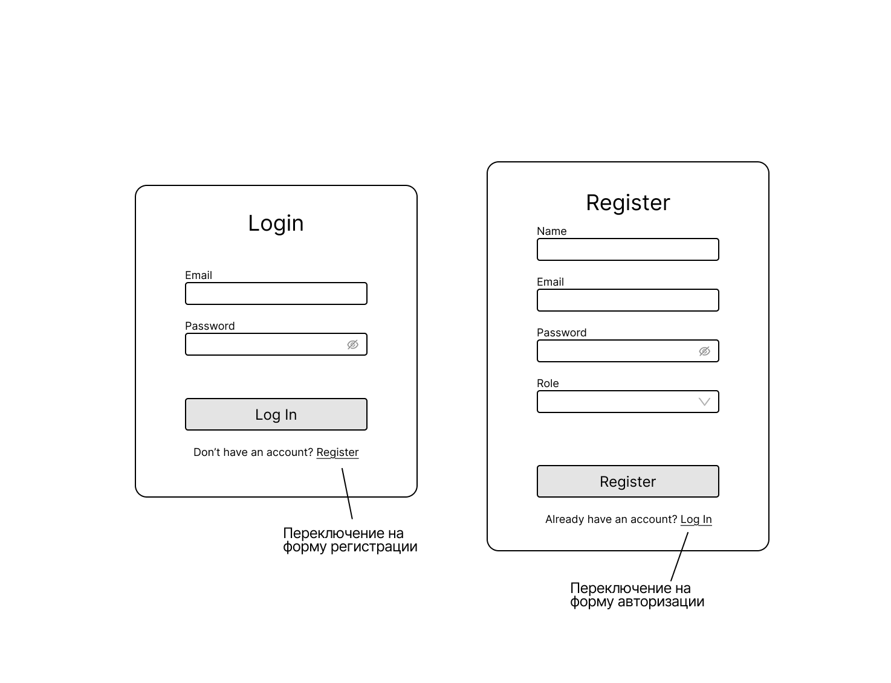
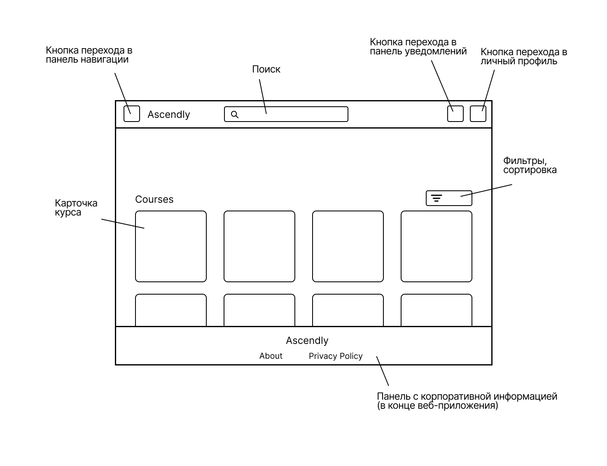
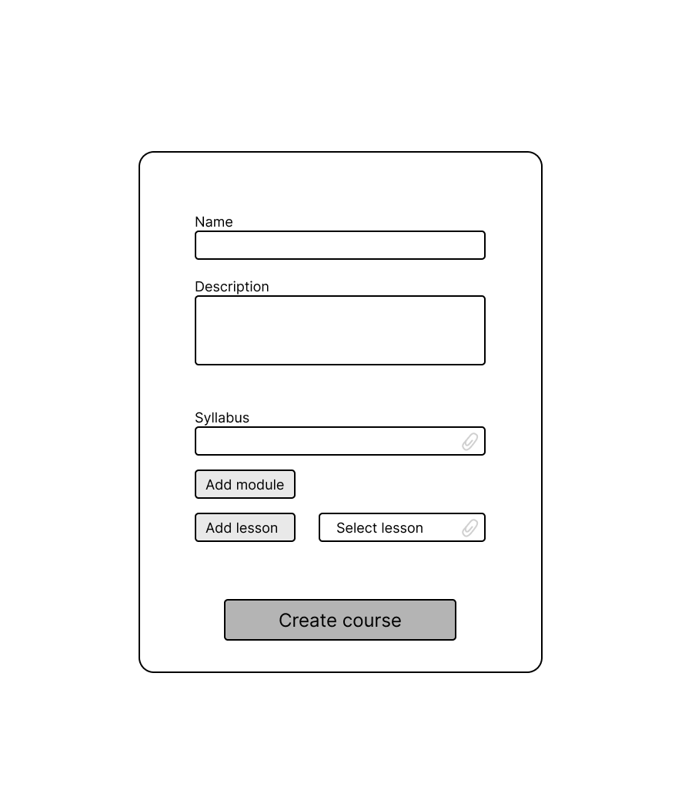
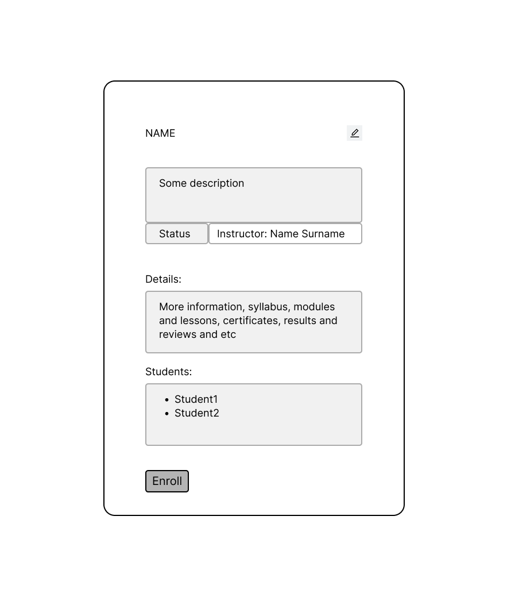
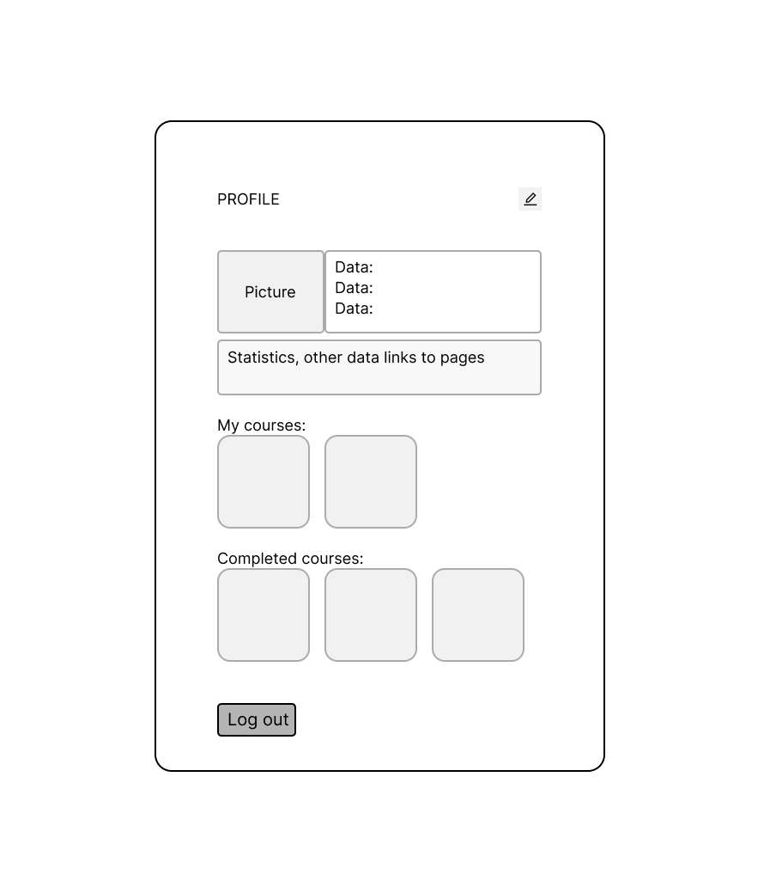

# Software Requirements Specification (SRS)
# Courses-Platform Application

**Версия:** 1.0

---
## Содержание
1. [Введение](#1-введение)
    - 1.1 [Назначение](#11-назначение)
    - 1.2 [Бизнес-требования](#12-бизнес-требования)
        - 1.2.1 [Исходные данные](#121-исходные-данные)
        - 1.2.2 [Возможности бизнеса](#122-возможности-бизнеса)
        - 1.2.3 [Границы проекта](#123-границы-проекта)
    - 1.3 [Аналоги](#13-аналоги)
2. [Требования пользователя](#2-требования-пользователя)
    - 2.1 [Программные интерфейсы](#21-программные-интерфейсы)
    - 2.2 [Интерфейс пользователя](#22-интерфейс-пользователя)
    - 2.3 [Характеристики пользователей](#23-характеристики-пользователей)
        - 2.3.1 [Классы пользователей](#231-классы-пользователей)
        - 2.3.2 [Аудитория приложения](#232-аудитория-приложения)
    - 2.4 [Предположения и зависимости](#24-предположения-и-зависимости)
3. [Системные требования](#3-системные-требования)
    - 3.1 [Функциональные требования](#31-функциональные-требования)
        - 3.1.1 [Основные функции](#311-основные-функции)
        - 3.1.2 [Ограничения и исключения](#312-ограничения-и-исключения)
    - 3.2 [Нефункциональные требования](#32-нефункциональные-требования)
        - 3.2.1 [Атрибуты качества](#321-атрибуты-качества)
        - 3.2.2 [Внешние интерфейсы](#322-внешние-интерфейсы)
        - 3.2.3 [Ограничения](#323-ограничения)

---

## 1 Введение

### 1.1 Назначение
Этот документ описывает функциональные и нефункциональные требования к веб-приложению **Ascendly**. Документ предназначен для команды разработчиков, тестировщиков и всех участников проекта, участвующих в реализации и верификации корректности работы приложения. **Ascendly** — это платформа для онлайн-курсов, ориентированная на создание, управление и потребление образовательного контента, с акцентом на коллаборативное обучение и персонализацию

### 1.2 Бизнес-требования

### 1.2.1 Исходные данные
В современном мире онлайн-обучение становится ключевым инструментом для саморазвития и профессионального роста. Однако существующие образовательные платформы часто перегружены коммерческим контентом, сложным интерфейсом или отсутствием фокуса на сообществе инструкторов и студентов, а также на качестве освоения материалов. Ascendly решает эти проблемы, предоставляя простую, масштабируемую платформу для бесплатного и платного доступа к курсам, с инструментами для взаимодействия и отслеживания прогресса

### 1.2.2 Возможности бизнеса
**Ascendly** позволит пользователям (студентам и инструкторам) создавать, записываться на курсы, отслеживать прогресс и взаимодействовать через обсуждения и задания, повышая вовлеченность и освоение материала. Платформа удовлетворит спрос на демократичное обучение, повышая удержание пользователей за счет геймификации и ИИ-инструментов, и создаст ценность через сообщество. В итоге, это минимизирует барьеры входа, ускоряя обучение и способствуя росту пользовательской базы. 
Бизнес-модель будет фокусироваться на freemium-подходе: базовый доступ бесплатный для привлечения аудитории, премиум-функции (расширенная аналитика, сертификаты и др.) — через подписку. Это создаст экосистему для партнерств с образовательными учреждениями и брендами, генерируя доход от комиссий с продаж курсов (ниже, чем у Udemy — 5-10% vs 30%), партнерских программ и таргетированной рекламы на основе пользовательских данных.

### 1.2.3 Границы проекта
Приложение Ascendly позволит зарегистрированным пользователям (студентам и инструкторам) создавать, просматривать, записываться на курсы, управлять прогрессом, участвовать в обсуждениях и выполнять задания. Для гостей будет доступен просмотр публичных курсов. Приложение не предоставляет функционала для обработки платежей или интеграции с внешними LMS-стандартами (например, SCORM), мобильные нативные приложения и оффлайн-доступ на начальном этапе, фокусируясь на основополагающих функциях: регистрация, управление курсами, зачисление и трекинг.

### 1.3 Аналоги
*   **Udemy:** Крупная платформа с тысячами курсов и монетизацией для инструкторов. **Отличие:** **Ascendly** фокусируется на open-source коллаборации и бесплатном доступе, без высоких комиссий (до 75% у Udemy), предлагая более низкий барьер для инструкторов и персонализацию через бесплатные AI-инструменты.
*   **Coursera:** Интеграция с университетами, сертификация. **Отличие:** Наша платформа ориентирована на пользовательский контент и сообщество, без основной направленности на академические партнерства, с большим упором на живое взаимодействие с сообществом, ИИ-помощником и геймификацию для повышения вовлеченности
*   **Khan Academy:** Бесплатные уроки с прогресс-трекингом. **Отличие:** **Ascendly** расширяет социальные элементы (живые дискусии, обсуждения, чаты), систему отзывов и аналитику, становясь более социальным и масштабируемым для студентов.

## 2 Требования пользователя

### 2.1 Программные интерфейсы
*   Backend приложения реализован на **Spring Boot** (Java, с модулями Web, Security, JPA, Validation).
*   Для хранения данных используется реляционная **PostgreSQL** база данных.
*   Фронтенд реализован на React.js с TypeScript, взаимодействующем с REST API бэкенда через Axios.
*   Аутентификация через JWT (Spring Security); контейнеризация с Docker для деплоя.

### 2.2 Интерфейс пользователя
Мокапы (прототипы) интерфейса будут разработаны с помощью инструмента **Figma** (или аналога) и выложены в репозиторий в папку `/mockups`. Эскизы включают:
*   Страницу регистрации и авторизации.
  
    
    
*   Главную страницу с поиском и обзором курсов.

    

*   Страницу создания/редактирования курса (фукнционал доступен инструктору).

    

*   Страницу деталей курса.

    

*   Страницу профиля.

    

### 2.3 Характеристики пользователей

### 2.3.1 Классы пользователей
| Класс пользователей | Описание |
| :--- | :--- |
| **Гости** | Неаутентифицированные пользователи. Могут просматривать публичные образовательные материалы, их детали. Не могут создавать и редактировать контент, записываться на программы и взаимодействовать с ними. |
| **Зарегистрированные студенты** | Аутентифицированные пользователи с ролью STUDENT_ROLE. Имеют доступ к функционалу: просмотр, зачисление, трекинг прогресса, выполнение заданий, обсуждения, чаты, удаление своих курсов. |
| **Зарегистрированные инструкторы** | Аутентифицированные пользователи с ролью INSTRUCTOR_ROLE. Имеют доступ к функционалу: CRUD-операции над курсами, аналитика студентов, модерация обсуждений, сообщества и чаты |
| **Администраторы** | Аутентифицированные пользователи с ролью ADMIN_ROLE. Имеют полный доступ к функционалу платформы. |

### 2.3.2 Аудитория приложения

#### 2.3.2.1 Целевая аудитория
Студенты, профессионалы и заинтересованные в обучении лица 16-35 лет, ищущие программы для самостоятельного дистанционного обучения. Учителя, профессора, инструкторы, эксперты, желающие делиться своими знаниями.

#### 2.3.2.2 Побочная аудитория
Корпоративные HR для группового обучения; образовательные сообщества для коллаборативных курсов.

### 2.4 Предположения и зависимости
*   Пользователи имеют базовые навыки работы с веб-приложениями.
*   Для полноценной работы приложения пользователю необходим стабильный доступ в Интернет.
*   Функционал приложения ограничен возможностями выбранного стека технологий (Spring Boot).

## 3 Системные требования

### 3.1 Функциональные требования

### 3.1.1 Основные функции

#### 3.1.1.1 Регистрация и аутентификация пользователя
**Описание.** Пользователь должен иметь возможность создать учетную запись или войти в существующую для получения доступа к полному функционалу.

| Функция | Требования |
| :--- | :--- |
| **Регистрация нового пользователя** | Система должна запросить уникальный логин (email), пароль и роль. После успешной регистрации пользователь автоматически аутентифицируется через JWT. |
| **Аутентификация пользователя** | Система должна предоставить форму для ввода логина (email) и пароля. При успешном вводе система предоставляет доступ к аккаунту и функционалу в зависимости от роли. |
| **Выход из системы** | Аутентифицированный пользователь выходит, JWT инвалидируется. |

#### 3.1.1.2 Управление профилем пользователя
**Описание.** Аутентифицированный пользователь должен иметь возможность просматривать и редактировать данные своего профиля.

**Требование.** Система должна предоставить интерфейс для изменения данных пользователя (например, имя, аватар). Отображение графики и полей в зависимости от роли.

#### 3.1.1.3 Управление курсами (Courses)
**Описание.** Аутентифицированные инструкторы добавляют/управляют курсами; все пользователи просматривают/ищут курсы, аутентифицированные студенты зачисляются/изучают материалы.

| Функция | Требования |
| :--- | :--- |
| **Добавление нового курса** | Форма для ввода данных о курсе: название, описание, учебный план, модули, материалы, дополнительные связанные атрибуты (квизы и др). |
| **Просмотр/поиск всех курсов** | Список всех курсов, поддержка фильтров (категория, рейтинг, уровень сложности); пагинация, поиск. |
| **Просмотр курса** | Вывод детальной информации о курсе, подгрузка материалов ввиду навигации, доступ к связанным дополнительным материалам и чату сообщества; возможность покинуть курс либо отредактивровать (при наличии прав инструктора/администратора).  |
| **Редактирование и удаление курса** | Пользователь с правами инструктора имеет возможность отредактировать или удалить любой из своих курсов, список обучающихся (при одобрении администратором). |

#### 3.1.1.4 Зачисление и прогресс-трекинг
**Описание.** Студенты записываются на курсы и отслеживают прогресс.

| Функция | Требования |
| :--- | :--- |
| **Зачисление на курс** | Интерфейс для зачисления на курс, обновление базы данных, уведомление инструктора. |
| **Отслеживание прогресса** | Интерфейс с процентом прохождения, информация о пройденных модулях и уроках, квизы/тесты, заметки. |
| **Выход из курса** | Выход с курса с сохранением истории и прохождении. |

#### 3.1.1.5 Управление заданиями (Assignments)
**Описание.** Пользователи должны иметь возможность искать и просматривать курсы, созданные инструкторами.

| Функция | Требования |
| :--- | :--- |
| **Создание задания** | Форма для вопросов, таймеров (квиз/интерактивное прохождение). |
| **Выполнение и оценка** | Форма подтверждения отправки выполненного задания, оценка, обратная связь. |

#### 3.1.1.6 Обсуждения (Discussions)
**Описание.** Пользователи взаимодействуют по курсам.

**Требование.** Форум (публикация, ответ, комментирование, реакции на контент, поиск по темам), публичные и приватные чаты с пользователями платформы (базовый фукнционал мессенджера).

### 3.1.2 Ограничения и исключения
*   Приложение не отвечает за точность и актуальность информации, введенной и отгруженной пользователями на платформу.
*   Нет хранения платежей и подключения к платежным системам.
*   Система чатов и интеграция ИИ - опциональная и не подразумевается на начальной стадии приложения.

### 3.2 Нефункциональные требования

### 3.2.1 Атрибуты качества

#### 3.2.1.1 Требования к удобству использования
*   Интерфейс должен быть интуитивно понятным и простым для нового пользователя.
*   Навигация по приложению должна быть последовательной и логичной.
*   Время обучения работе с основными функциями не должно превышать 10 минут.

#### 3.2.1.2 Требования к безопасности
*   Пароли пользователей должны храниться в базе данных в захэшированном виде; HTTPS, ограничение функционала в соответствии с ролями.
*   Пользователь имеет доступ только к своим данным.
*   Все операции на стороне сервера должны проверять авторизацию пользователя; корректное обновление JWT токенов.

#### 3.2.1.3 Требования к доступности
*   Основные функции приложения должны быть доступны при скорости интернета не ниже 1 Мбит/с.
*   Кроссплатформенность. 
*   Время отклика на большинство пользовательских действий не должно превышать 2 секунд.

### 3.2.2 Внешние интерфейсы
*   **Пользовательский интерфейс:** Должен быть выполнен в минималистичном, современном стиле. Шрифты должны быть читаемыми, размер элементов — достаточным для комфортного использования на десктопных и мобильных устройствах (адаптивный дизайн).
*   **Программный интерфейс:** Приложение предоставляет REST API для взаимодействия между клиентом и сервером.

### 3.2.3 Ограничения
*   Приложение реализовано как веб-приложение на основе **Spring Boot**.
*   Язык разработки backend: **Java**.
*   Для хранения данных используется реляционная **PostgreSQL**.
